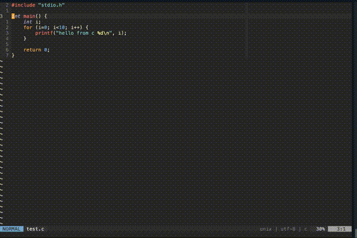

# About

This plugin can do several things.

1. Run your current file and send STDOUT to an "output buffer" using automatic file type detection 
  - The command is executed asynchronously leaving your editor fully usable
  - Standard Error is sent to the quickfix window
  - The process is timed and reported in seconds to 6 decimal places at the end
  of the running job
  - The "output buffer" is a scratch vim buffer with custom syntax highlighting
2. Run your current file in a neovim terminal using automatic file type detection 
3. Start a REPL using automatic file type detection
4. Send selected text and text between commented delimiters to a REPL (or terminal)

# Demo

Run current file in output buffer


Run current file containing errors for quickfix



Run current file in a terminal


Send text between delimiters to a REPL


# Extensibility

- Out of the box, this plugin comes with several functions and default mappings.
- Eventually the default mappings will be optional and can be setup by the user
individually
- Both the commands used to run the current file and start a REPL for the current
file can be modified via a global dictionary defined in the `init.vim` or `vimrc`.

The file running dictionary is defined like this and comes out of the box
with support for 50 languages.

```vim
let g:terminator_runfile_map = {
            \ "javascript": "node",
            \ "python": "python -u",
            \ "c": "gcc $dir$fileName -o $dir$fileNameWithoutExt && $dir$fileNameWithoutExt",
            \ "fortran": "cd $dir && gfortran $fileName -o $fileNameWithoutExt && $dir$fileNameWithoutExt"
            \ }
```
allowing use of the variables defined below


| variable name            | description                                                                |
| ---                      | ---                                                                        |
| $fileName                | what you would get from running  `basename` on the file                    |
| $fileNameWithoutExt      | same as $fileName with everything after and including the last `.` removed |
| $dir                     | the full path of the parent directory of the filename                      |
| $dirWithoutTrailingSlash | same as $dir with the trailing slash removed                               |


The REPL command dictionary is defined like this.

```vim
let g:terminator_repl_command = {
  \'python' : ['ipython', '--no-autoindent'],
  \'javascript': ['node'],
  \}
````


# Installation

Using `vim-plug`

```vim
plug 'erietz/vim-terminator'
```

# Usage

- `<leader>ot`: Open a new blank terminal so the plugin can send command to it
  - This will reopen a terminal if one has already been opened and the buffer
  has not been deleted.
- `<leader>or`: Opens a repl in the open terminal
- `<leader>rf`: Runs your current file in the open terminal
- `<leader>rr`: Runs your current file in the scratch buffer
- `<leader>sf` : Runs your entire file in a REPL
  - Currently only works for python
- `<leader>sd` : Send text in delimeter to terminal
